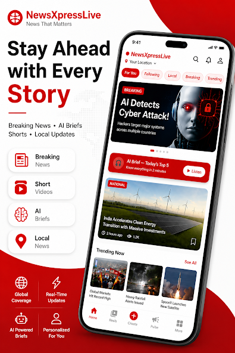
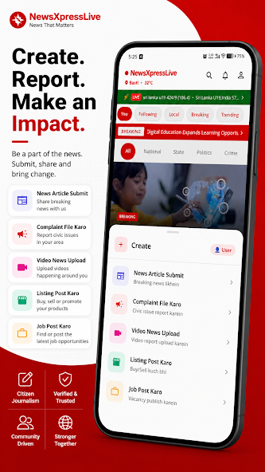
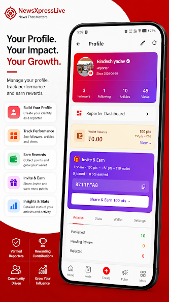

# News Xpress Live

News Xpress Live is a production news platform built and maintained by SoftDigi Technology.

The platform combines a Flutter mobile application with a PHP/MySQL backend and REST APIs to support news publishing, user management, personalized content delivery and location-based news discovery.

## Project Status

**Production — Live on Google Play**

The mobile application is publicly available on the Google Play Store.

[View News Xpress Live on Google Play](https://play.google.com/store/apps/details?id=com.softdigi.newsxpresslive&hl=en_IN)

## Key Features

- Flutter mobile application
- PHP backend
- MySQL database
- REST API architecture
- Admin panel
- Reporter dashboard
- User management
- Authentication and security
- Role-based access
- Personalized news feed
- Location-based news filtering
- News publishing workflow
- RSS/news ingestion
- Xpress feature
- AI-powered short news summaries

## Technology Stack

| Layer | Technology |
|---|---|
| Mobile Application | Flutter / Dart |
| Backend | PHP |
| Database | MySQL |
| API | REST APIs |
| Content Processing | RSS |
| AI Features | AI-powered news summarization |

## Engineering

The project is developed as an API-driven production system.

The separation between the mobile application and backend services allows the platform to evolve independently and provides a foundation for extending the product to additional clients or technologies in the future.

## Architecture

News Xpress Live follows an API-driven architecture that separates the mobile application from backend services and data storage.

```text
┌─────────────────────────┐
│   Flutter Mobile App    │
│       Dart / UI         │
└────────────┬────────────┘
             │
             │ REST API
             ▼
┌─────────────────────────┐
│      PHP Backend        │
│ Business Logic & APIs   │
│ Authentication & Roles  │
└────────────┬────────────┘
             │
             ▼
┌─────────────────────────┐
│       MySQL Database    │
│ Users • News • Content  │
│ Roles • Application Data│
└─────────────────────────┘
```

Additional platform components support content ingestion, administration, reporting workflows and AI-powered news processing.

This separation allows the application and backend services to evolve independently and provides a foundation for supporting additional clients or technologies in the future.

## API & Backend

The backend provides REST APIs that act as the communication layer between the mobile application and server-side services.

The API layer is responsible for handling application data and business operations such as:

- User authentication
- User management
- News retrieval and publishing
- Personalized content delivery
- Location-based filtering
- Reporter workflows
- Content processing
- Application data management

The Flutter application communicates with the backend through these APIs rather than directly accessing the database.

This separation helps keep the client application independent from the underlying database and server-side implementation.

## Authentication & Security

The platform includes authentication and access-control mechanisms to protect application functionality and user-specific data.

Security-related engineering includes:

- User authentication
- Role-based access
- Protected application functionality
- User management
- Secure communication between the application and backend APIs
- Access control for different application workflows

Security is treated as part of the application architecture rather than as an afterthought.

Sensitive credentials, API keys, passwords and other secrets are not intended to be stored in the public repository.

## Deployment & Maintenance

News Xpress Live is deployed as a live production application and is actively maintained.

Production engineering work includes:

- Application deployment
- Backend and API maintenance
- Database maintenance
- Bug fixing and troubleshooting
- Feature updates
- Security improvements
- Performance optimization
- Production issue resolution

The project is maintained with a focus on reliability, maintainability and continuous improvement.

## Current Status

News Xpress Live is a live production application available on the Google Play Store.

The platform is actively maintained and continues to evolve through feature development, backend improvements, security updates, bug fixes and performance optimization.

### Currently Implemented

- Flutter mobile application
- PHP backend
- MySQL database
- REST API architecture
- Authentication
- Role-based access
- Admin panel
- Reporter dashboard
- Personalized news feed
- Location-based news filtering
- News publishing workflow
- RSS/news ingestion
- Xpress feature
- AI-powered short news summaries

### Production

**Status:** Live

**Platform:** Android / Google Play

[View on Google Play](https://play.google.com/store/apps/details?id=com.softdigi.newsxpresslive&hl=en_IN)
## Production & Maintenance

The application is deployed as a live production product and is actively maintained.

Engineering work includes:

- Feature development
- Backend and API development
- Database integration
- Authentication and security
- Debugging and maintenance
- Content processing
- Production deployment
- Performance and reliability improvements

## Screenshots

<div align="center">








</div>

## Future Improvements

The project will continue to evolve based on product requirements and engineering priorities.

Potential areas of future improvement include:

- Further performance optimization
- Additional platform capabilities
- API and backend improvements
- Improved testing and reliability
- Continued security enhancements
- Further AI-powered functionality

Future improvements will be documented as they are designed and implemented.

---

**Developed and maintained by SoftDigi Technology**
